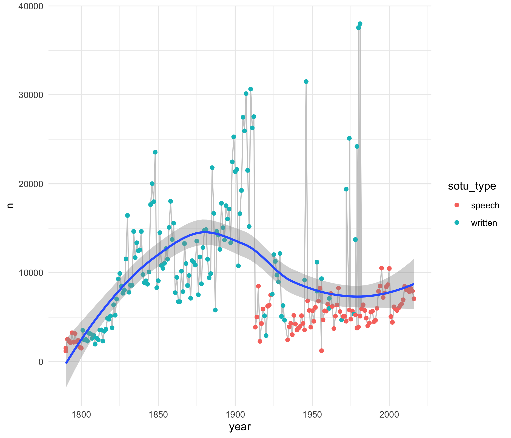
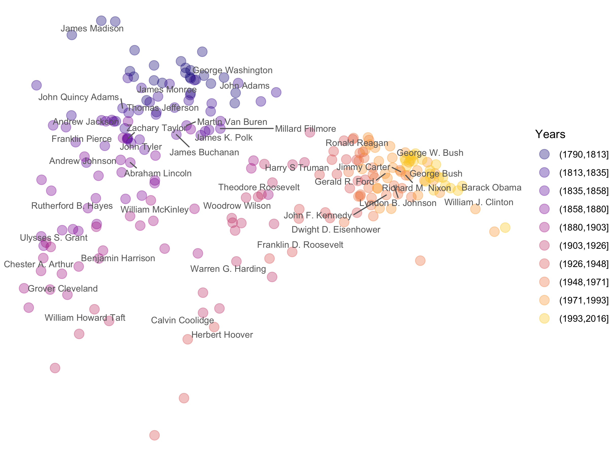
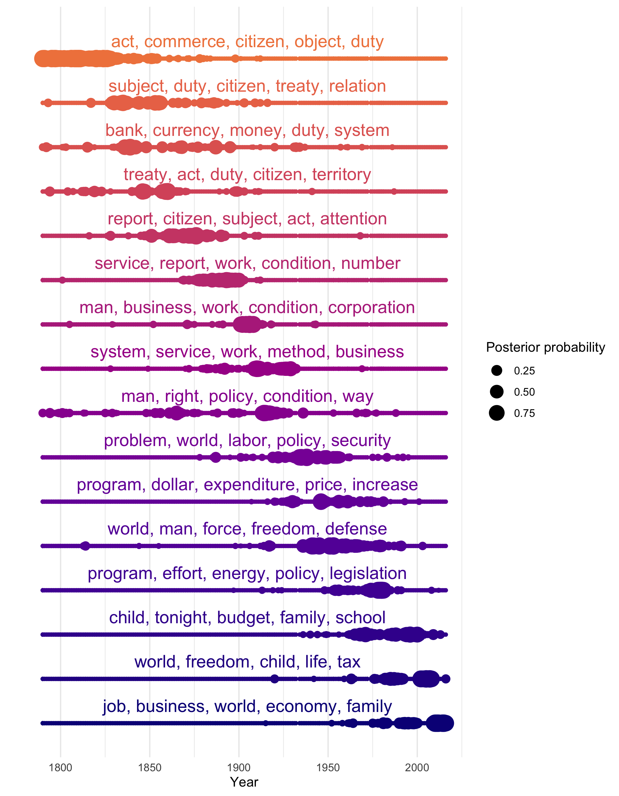
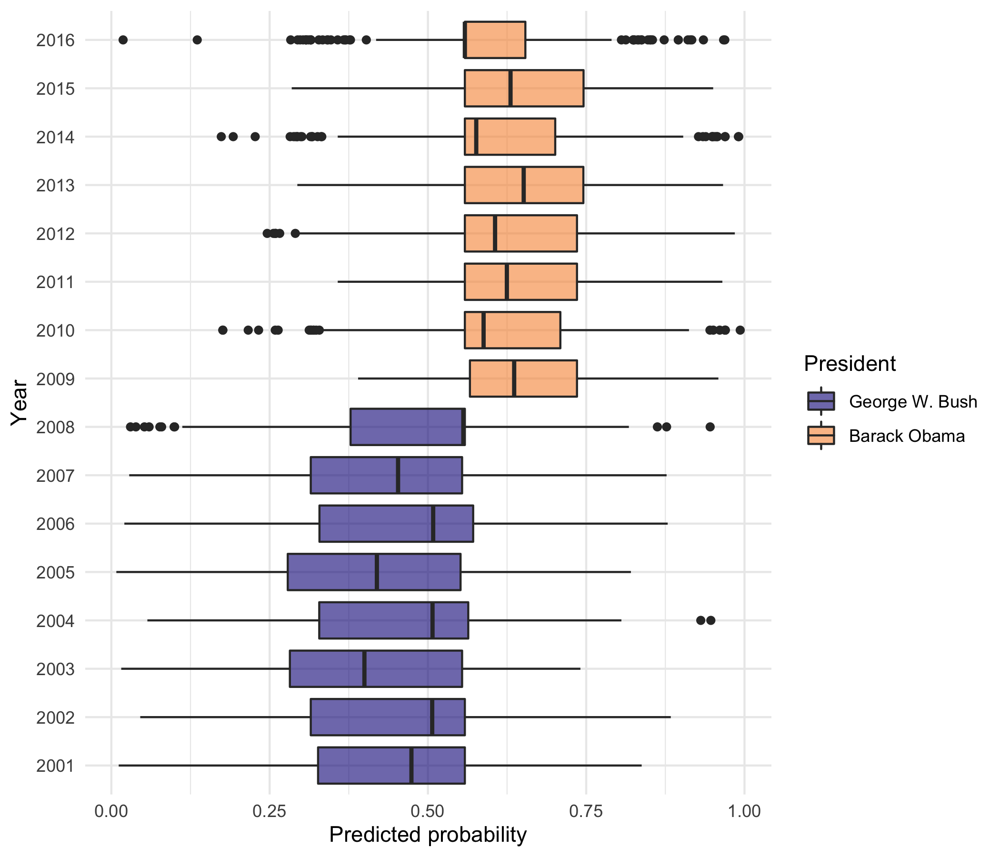

**This vignette shows the updated version 3 of the package, now available on CRAN**

```{r setup, include=FALSE}
# CRAN will not have spaCy installed, so create static vignette
knitr::opts_chunk$set(eval = FALSE)
```

In this vignette, the utility of the package is illustrated by showing how it can be
used to study a corpus consisting of every
State of the Union Address made by a United States president through 2016. It
highlights some of the major benefits of the tidy datamodel as it applies to the study of
textual data, though by no means attempts to give an exhaustive coverage of all the available
tables and approaches. The examples make heavy use of the table verbs provided by **dplyr**,
the piping notation of **magrittr** and **ggplot2** graphics. These are used because they
best illustrate the advantages of the tidy data model that has been built in **cleanNLP**
for representing corpus annotations.

```{r, echo = FALSE, message=FALSE}
library(magrittr)
library(dplyr)
library(ggplot2)
library(cleanNLP)
library(sotu)
```

## Running the cleanNLP annotation

We start by running the spacy annotation engine over the input dataset. We start by initilizing
the spacy backend:

```{r}
cnlp_init_spacy()
```

Now, prepare the dataset by putting the text into a column of the metadata table:

```{r}
input <- sotu_meta
input$text <- sotu_text
```

Then, extract annotations from the dataset:

```{r}
anno <- cnlp_annotate(input)
```

When running the code above on your own, you will see a progress message every
time a nex set of 10 documents are processed.

## Exploratory Analysis

Simple summary statistics are easily computed from the table of tokens. To see
the distribution of sentence length, the token table is grouped by the document
and sentence id and the number of rows within each group are computed. The percentiles
of these counts give a quick summary of the distribution.

```{r}
anno$token %>%
  group_by(doc_id, sid) %>%
  summarize(sent_len = n()) %$%
  quantile(sent_len, seq(0,1,0.1))
```
```
0%  10%  20%  30%  40%  50%  60%  70%  80%  90% 100%
 1    9   14   18   22   26   30   35   42   55  398
```

The median sentence has 26 tokens, whereas at least one has over 600 (this is
due to a bulleted list in one of the written addresses being treated as a single sentence)
To see the most frequently used nouns in the dataset, the token table is filtered on the universal
part of speech field, grouped by lemma, and the number of rows in each group are once again
calculated. Sorting the output and selecting the top $42$ nouns, yields a high level summary
of the topics of interest within this corpus.

```{r}
anno$token %>%
  filter(upos == "NOUN") %>%
  group_by(lemma) %>%
  summarize(count = n()) %>%
  top_n(n = 42, count) %>%
  arrange(desc(count)) %>%
  use_series(lemma)
```
```
[1] "year"          "country"       "people"        "law"
[5] "nation"        "time"          "government"    "power"
[9] "interest"      "world"         "war"           "citizen"
[13] "service"       "part"          "duty"          "system"
[17] "peace"         "right"         "state"         "man"
[21] "program"       "policy"        "work"          "condition"
[25] "legislation"   "act"           "force"         "subject"
[29] "effort"        "purpose"       "treaty"        "business"
[33] "land"          "action"        "measure"       "way"
[37] "question"      "relation"      "consideration" "attention"
[41] "report"        "life"
```

The result is generally as would be expected from a corpus of government speeches, with
references to proper nouns representing various organizations within the government and
non-proper nouns indicating general topics of interest such as "country", "law", and
"peace".

The length in tokens of each address is calculated similarly by grouping and summarizing at
the document id level. The results can be joined with the document table to get the year
of the speech and then piped in a **ggplot2** command to illustrate how the length of
the State of the Union has changed over time.

```{r, fig.height=6, fig.width=7}
anno$token %>%
  group_by(doc_id) %>%
  summarize(n = n()) %>%
  left_join(anno$document, by="doc_id") %>%
  ggplot(aes(year, n)) +
    geom_line(color = grey(0.8)) +
    geom_point(aes(color = sotu_type)) +
    geom_smooth(method="loess", formula = y ~ x) +
    theme_minimal()
```



Here, color is used to represent whether the address was given as an oral address or a written
document. The output shows that their are certainly time trends
to the address length, with the form of the address (written versus spoken) also having a large
effect on document length.

Finding the most used entities from the entity table over the time period of the corpus yields an
alternative way to see the underlying topics. A slightly modified version of the code
snippet used to find the top nouns in the dataset can be used to find the top entities.

```{r}
anno$entity %>%
  filter(entity_type == "LOC") %>%
  group_by(entity) %>%
  summarize(count = n()) %>%
  top_n(n = 44, count) %>%
  arrange(desc(count)) %>%
  use_series(entity)
```
```
[1] "Europe"                 "Pacific"                "Asia"
[4] "Atlantic"               "Africa"                 "Territories"
[7] "the Middle East"        "Central America"        "South"
[10] "West"                   "earth"                  "Mississippi"
[13] "Earth"                  "Latin America"          "South America"
[16] "East"                   "Mediterranean"          "the Gulf of Mexico"
[19] "the Southern States"    "Western Europe"         "North"
[22] "the Pacific Ocean"      "the Rocky Mountains"    "Americas"
[25] "the Western Hemisphere" "the Far East"           "the Mississippi River"
[28] "Gulf"                   "the Persian Gulf"       "Middle East"
[31] "Prussia"                "Caribbean"              "Eastern Europe"
[34] "Southeast Asia"         "Lake Erie"              "North America"
[37] "the Pacific Coast"      "the Northern States"    "Bering Sea"
[40] "District"               "the Near East"          "the west coast"
[43] "the West Indies"        "South Asia"             "Southwest Asia"
[46] "the Bering Sea"         "West Point"
```

The ability to redo analyses from a slightly different perspective is a direct consequence of
the tidy data model supplied by **cleanNLP**.

The top locations include some obvious and some less obvious instances.
Those sovereign nations included such as Great Britain, Mexico, Germany, and Japan seem
as expected given either the United State's close ties or periods of war with them. The top states
include the most populous regions  but also smaller states.

One of the most straightforward way of extracting a high-level summary of the content of a speech
is to extract all direct object object dependencies where the target noun is not a very common word.
In order to do this for a particular speech, the dependency table is joined to the document table,
a particular document is selected, and relationships of type "dobj" (direct object)
are filtered out. The result is then joined to the data set `word_frequency`, which is
included with **cleanNLP**, and pairs with a target occurring less than 0.5\% of the time
are selected to give the final result. Here is an example of this using the first address made
by George W. Bush in 2001:

```{r}
anno$token %>%
  left_join(
    anno$token,
    c("doc_id"="doc_id", "sid"="sid", "tid"="tid_source"),
    suffix=c("", "_source")
  ) %>%
  left_join(anno$document, by="doc_id") %>%
  filter(year == 2001) %>%
  filter(relation == "dobj") %>%
  select(doc_id = doc_id, start = token, word = token_source) %>%
  left_join(word_frequency, by="word") %>%
  filter(frequency < 0.001) %>%
  select(doc_id, start, word) %$%
  sprintf("%s => %s", start, word)
```
```
[1] "signs => layoffs"        "amount => unprecedented"
[3] "effort => recruit"       "care => lawsuits"
[5] "approach => hopeful"     "poor => disadvantaged"
[7] "meal => mentor"          "action => compassionate"
[9] "dollars => trillion"     "marriage => discourage"
[11] "strategy => confront"    "people => allies"
[13] "defenses => missile"     "ourselves => allies"
[15] "ability => negotiate"
```

Most of these phrases correspond with the "compassionate conservatism" that George W. Bush ran
under in the preceding 2000 election. Applying the same analysis to the 2002 State of the Union,
which came under the shadow of the September 11th terrorist attacks, shows a drastic shift
in focus.

```{r}
anno$token %>%
  left_join(
    anno$token, c("doc_id"="doc_id", "sid"="sid", "tid"="tid_source"),
    suffix=c("", "_source")
  ) %>%
  left_join(anno$document, by="doc_id") %>%
  filter(year == 2002) %>%
  filter(relation == "dobj") %>%
  select(doc_id = doc_id, start = token, word = token_source) %>%
  left_join(word_frequency, by="word") %>%
  filter(frequency < 0.001) %>%
  select(doc_id, start, word) %$%
  sprintf("%s => %s", start, word)
```
```
[1] "dangers => unprecedented" "debt => owe"
[3] "terrorists => regimes"    "terrorists => plotting"
[5] "parasites => threaten"    "gas => poison"
[7] "defenses => missile"      "America => allies"
[9] "America => allies"        "police => heroic"
[11] "police => firefighters"   "arrivals => departures"
[13] "neighborhoods => safer"   "package => stimulus"
[15] "ethic => creed"           "best => emerged"
[17] "doctors => mobilized"     "efforts => recruit"
[19] "peace => prosperity"      "freedom => dignity"
```

Here the topics have almost entirely shifted to counter-terrorism and national security efforts.

## Models

### Principal Component Analysis (PCA)

The ``cnlp_utils_tfidf`` function provided by **cleanNLP** converts a token table into
a sparse matrix representing the term-frequency inverse document frequency matrix (or
any intermediate part of that calculation). This is particularly useful when building
models from a textual corpus. The ``cnlp_utils_pca``, also included with the package,
takes a matrix and returns a data frame containing the desired number of principal
components. Dimension reduction involves piping the token table for a corpus
into the ``cnlp_utils_tfidf`` function and passing the results to ``cnlp_utils_pca``.

```{r}
pca <- anno$token %>%
  filter(xpos %in% c("NN", "NNS")) %>%
  cnlp_utils_tfidf(min_df = 0.05, max_df = 0.95, tf_weight = "dnorm") %>%
  cnlp_utils_pca()
pca <- bind_cols(anno$document, pca)
pca
```
```
# A tibble: 236 x 8
   president          year years_active party      sotu_type doc_id    PC1   PC2
   <chr>             <int> <chr>        <chr>      <chr>      <int>  <dbl> <dbl>
 1 George Washington  1790 1789-1793    Nonpartis… speech         1  -2.30  13.0
 2 George Washington  1790 1789-1793    Nonpartis… speech         2  -4.37  16.5
 3 George Washington  1791 1789-1793    Nonpartis… speech         3  -5.48  12.8
 4 George Washington  1792 1789-1793    Nonpartis… speech         4  -3.54  12.1
 5 George Washington  1793 1793-1797    Nonpartis… speech         5 -16.8   18.8
 6 George Washington  1794 1793-1797    Nonpartis… speech         6  -5.98  13.6
 7 George Washington  1795 1793-1797    Nonpartis… speech         7 -12.7   20.6
 8 George Washington  1796 1793-1797    Nonpartis… speech         8  -8.98  12.6
 9 John Adams         1797 1797-1801    Federalist speech         9  -1.19  10.9
10 John Adams         1798 1797-1801    Federalist speech        10  -5.54  13.0
# … with 226 more rows
```

In this example only non-proper nouns have been included in order to minimize the
stylistic attributes of the speeches in order to focus more on their content.
We can draw a scatter plot of the speeches using these components to see a
definitive temporal pattern to the documents, with the 20th century addresses
forming a distinct cluster on the right side of the plot.

```{r, fig.height=6, fig.width=7}
ggplot(pca, aes(PC1, PC2)) +
  geom_point(aes(color = cut(year, 10, dig.lab = 4)), alpha = 0.35, size = 4) +
  ggrepel::geom_text_repel(data = filter(pca, !duplicated(president)),
                  aes(label = president), color = grey(0.4), cex = 3) +
  labs(color = "Years") +
  scale_color_viridis_d(end = 0.9, option = "C") +
  theme(axis.title.x = element_text(size = 14),
        axis.title.y = element_text(size = 14),
        axis.text.x = element_blank(),
        axis.text.y = element_blank()) +
  theme_void()
```



### Topic Models (LDA)

The output of the ``cnlp_utils_tf`` function (it calls ``cnlp_utils_tfidf`` with different
default parameters to yield raw term frequencies) may be given directly to the ``LDA``
function in the package **topicmodels**.

```{r, message=FALSE, warning=FALSE}
library(topicmodels)
mat <- anno$token %>%
  filter(xpos %in% c("NN", "NNS")) %>%
  cnlp_utils_tf(min_df = 0.05, max_df = 0.95)

tm <- LDA(mat, k = 16)
```

The topics, ordered by approximate time period, are visualized below:

```{r, fig.height=9, fig.width=7}
terms <- posterior(tm)$terms
topics <- posterior(tm)$topics
topic_df <- tibble(topic = as.integer(col(topics)),
                   doc_id = anno$document$doc_id[as.integer(row(topics))],
                   val = as.numeric(topics)) %>%
              left_join(anno$document, by="doc_id")
top_terms <- apply(terms, 1,
               function(v) {
                 paste(colnames(mat)[order(v, decreasing = TRUE)[1:5]], collapse = ", ")
                 })
top_terms <- as.character(top_terms)

index <- rank(-1 * tapply(topic_df$year * topic_df$val, topic_df$topic, which.max))
topic_df$topic_new <- index[topic_df$topic]
top_terms_df <- tibble(top_terms, topic = 1:length(top_terms))
top_terms_df$topic_new <- index[top_terms_df$topic]

ggplot(topic_df, aes(year, topic_new)) +
  geom_point(aes(size = val, color = factor(topic_new))) +
  geom_text(data = top_terms_df, x = mean(topic_df$year),
            size = 5, aes(y = topic_new + 0.4, label = top_terms, color = factor(topic_new)),
            show.legend = FALSE) +
    scale_color_viridis_d(end = 0.7, option = "C") +
  theme(axis.text.y=element_blank(),
        axis.title.y=element_blank(),
        legend.position="bottom",
        axis.title.x = element_text(size = 16),
        axis.text.x = element_text(size = 14)) +
  labs(size = "Posterior probability") +
  theme_minimal() +
  scale_y_continuous(breaks=FALSE) +
  ylab("") +
  xlab("Year") +
  guides(colour = FALSE)
```



Most topics persist for a few decades and then largely disappear, though some persist over
non-contiguous periods of the presidency. The Energy topic, for example, appears during the
1950s and crops up again during the energy crisis of the 1970s. The "world, man, freedom,
force, defense" topic peaks during both World Wars, but is absent during the 1920s and early
1930s.

### Predictive Models

Finally, the **cleanNLP** data model is also convenient for building predictive models.
The State of the Union corpus does not lend itself to an obviously applicable prediction problem.
A classifier that distinguishes speeches made by George W. Bush and Barrack Obama will be constructed
here for the purpose of illustration.

As a first step, a term-frequency matrix is extracted using the same technique as was used with
the topic modeling function. However, here the frequency is computed for each sentence in the
corpus rather than the document as a whole.

```{r}
df <- anno$token %>%
  left_join(anno$document, by="doc_id") %>%
  filter(year > 2000) %>%
  mutate(new_id = paste(doc_id, sid, sep = "-")) %>%
  filter(xpos %in% c("NN", "NNS"))
mat <- cnlp_utils_tf(df, doc_var = "new_id")
dim(mat)
```
```
[1] 4938 2349
```

It will be necessary to define a response variable ``y`` indicating whether this is a
speech made by President Obama as well as a training flag indicating which speeches were
made in odd numbered years. This is done via a separate table join and a pair of mutations.

```{r}
meta <- tibble(new_id = rownames(mat)) %>%
  left_join(df[!duplicated(df$new_id),], by="new_id") %>%
  mutate(y = as.numeric(president == "Barack Obama")) %>%
  mutate(train = year %in% seq(2001, 2016, by = 2))
```

The output may now be used as input to the elastic net function provided
by the **glmnet** package. The response is set to the binomial family
given the binary nature of the response and training is done on only those speeches
occurring in odd-numbered years. Cross-validation is used in order to select the
best value of the model's tuning parameter.

```{r, message=FALSE}
library(glmnet)
model <- cv.glmnet(mat[meta$train,], meta$y[meta$train], family = "binomial")
```

A boxplot of the predicted classes for each address is given below:

```{r, fig.height=6, fig.width=7}
meta$pred <- predict(model, newx = mat, type = "response", s = model$lambda.1se)
ggplot(meta, aes(factor(year),pred)) +
  geom_boxplot(aes(fill = relevel(factor(president), "George W. Bush"))) +
  labs(fill = "President") + xlab("year") + ylab("predicted probability") +
  scale_fill_viridis_d(alpha = 0.6, end = 0.75, option = "C") +
  coord_flip() +
  theme(axis.title.x = element_text(size = 12),
        axis.text.x = element_text(size = 10),
        axis.title.y = element_text(size = 12),
        axis.text.y = element_text(size = 10)) +
  theme_minimal() +
  ylab("Predicted probability") +
  xlab("Year")
```



The algorithm does a very good job of separating the speeches. Looking
at the odd years versus even years (the training and testing sets, respectively)
indicates that the model has not been over-fit.

One benefit of the penalized linear regression model is that it is possible to interpret the
coefficients in a meaningful way. Here are the non-zero elements of the regression vector,
coded as whether the have a positive (more Obama) or negative (more Bush) sign:

```{r}
beta <- coef(model, s = model[["lambda"]][11])[-1]
sprintf("%s (%d)", colnames(mat), sign(beta))[beta != 0]
```
```
[1] "job (1)"          "business (1)"     "family (1)"       "citizen (-1)"
[5] "terrorist (-1)"   "freedom (-1)"     "education (1)"    "home (1)"
[9] "college (1)"      "weapon (-1)"      "deficit (1)"      "company (1)"
[13] "enemy (-1)"       "peace (-1)"       "terror (-1)"      "hope (-1)"
[17] "income (-1)"      "drug (-1)"        "kid (1)"          "regime (-1)"
[21] "class (1)"        "crisis (1)"       "industry (1)"     "need (-1)"
[25] "fact (1)"         "relief (-1)"      "bank (1)"         "liberty (-1)"
[29] "funding (-1)"     "society (-1)"     "account (-1)"     "cause (-1)"
[33] "folk (1)"         "duty (-1)"        "compassion (-1)"  "supply (-1)"
[37] "environment (-1)" "inspector (-1)"
```

These generally seem as expected given the main policy topics of focus under
each administration. During most of the Bush presidency, as mentioned
before, the focus was on national security and foreign policy. Obama, on the other hand,
inherited the recession of 2008 and was far more focused on the overall economic policy.
